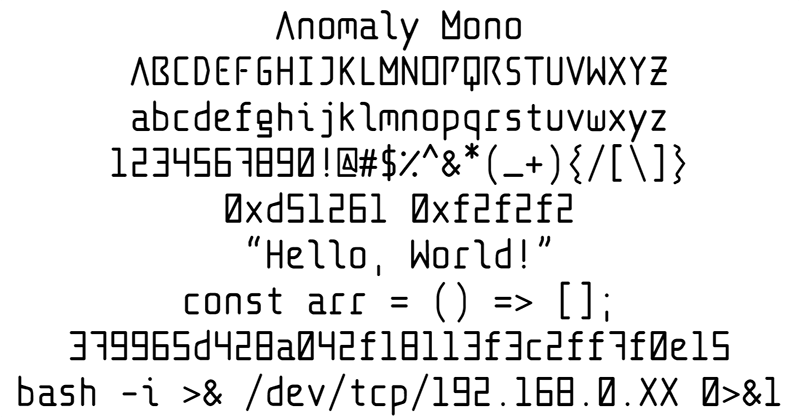

# Anomaly Mono

A unique monospaced programming font, inspired by "retrofuturism". The letters of the font are designed as an homage to the aesthetic of older science fiction movies and magazines, while the numbers are inspired by seven-segment digit displays. Symbols and numbers were given special design consideration to stand out from alphabetical characters as well. Overall, the font is noteworthy for its unique appearance while still maintaining legibility for writing and debugging code.

## Features
- [x] Powerline glyphs
- [x] Bold variant
- [ ] Italic variant
- [ ] Ligatures

## Install
Download the Anomaly Mono OTF files and open them. Your OS should prompt you with an option to install the new font.

If you're on Linux, you can also create an "AnomalyMono" directory under `/usr/share/fonts`, and move the OTF files into the new directory.

## Screenshots

## Author/License
Created by [Ben Busby](https://benbusby.com) (contact@benbusby.com)

Licensed under the SIL Open Font License ([see LICENSE](LICENSE))
