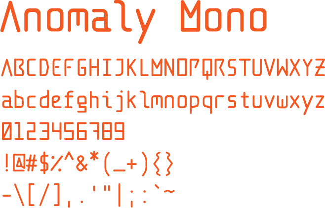
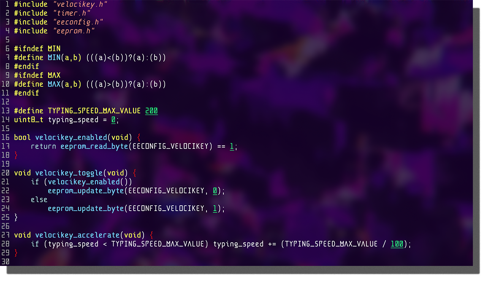
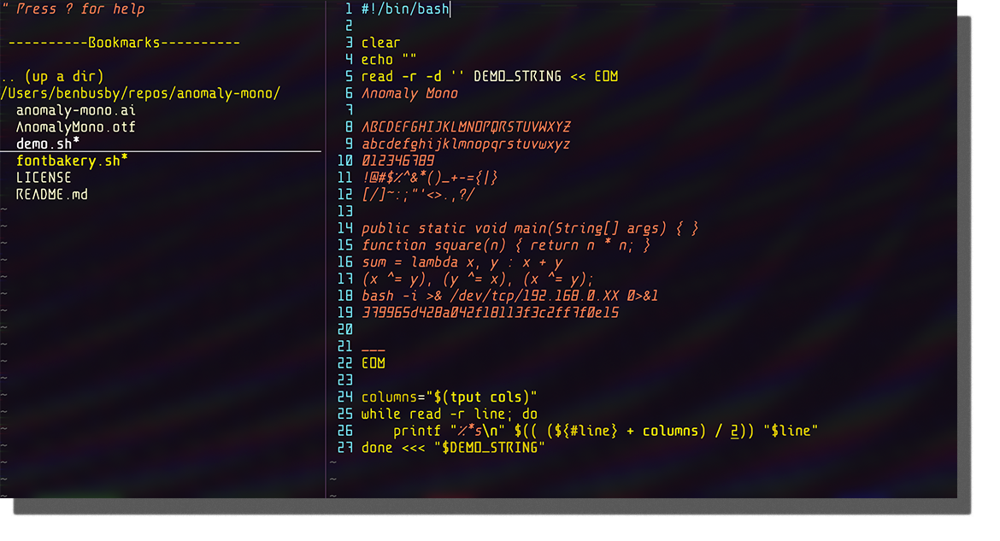
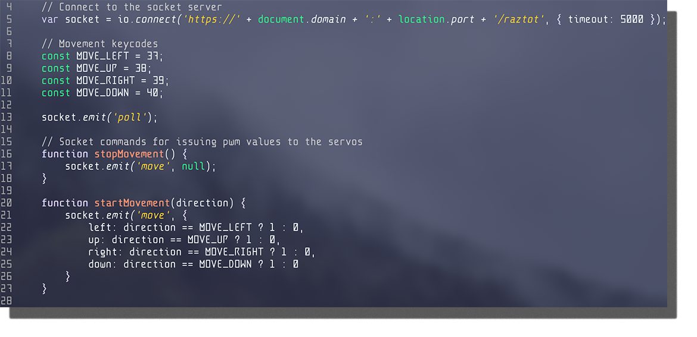
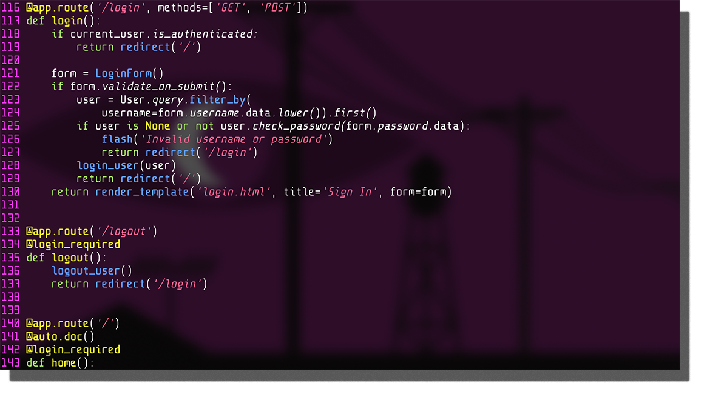

# Anomaly Mono
A unique monospaced programming font, inspired by "retrofuturism". The alphabetical characters of the font are designed as an homage to older science fiction magazines, drawing inspiration from the smooth curves and sharp angles often seen on their cover art. The numerical characters are an expansion on digital clock numbers, and symbols were given special design consideration to stand out from alphanumeric characters as well. The result is a font that creates a strong distinction between all types of glyphs and has a unique appearance, while still maintaining perfect legibility for writing and debugging code.

## Installation
Download [the AnomalyMono.otf file](AnomalyMono.otf) and open it. Your OS should see that it's a new font file and give you the option to install it.

## Author/License
Created by [Ben Busby](https://benbusby.com) (contact@benbusby.com)

Licensed under the SIL Open Font License ([see LICENSE](LICENSE))
