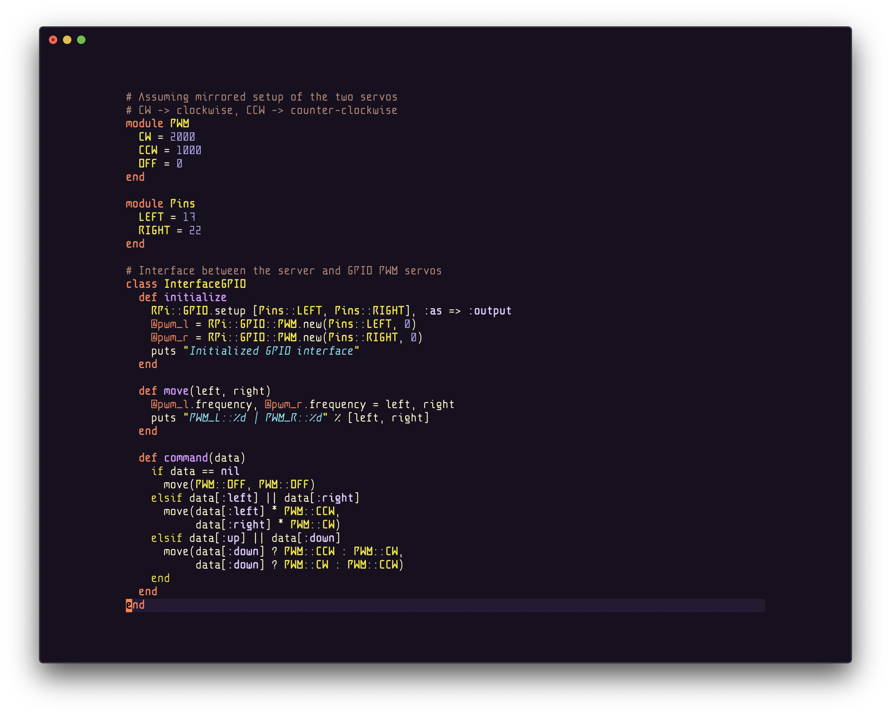
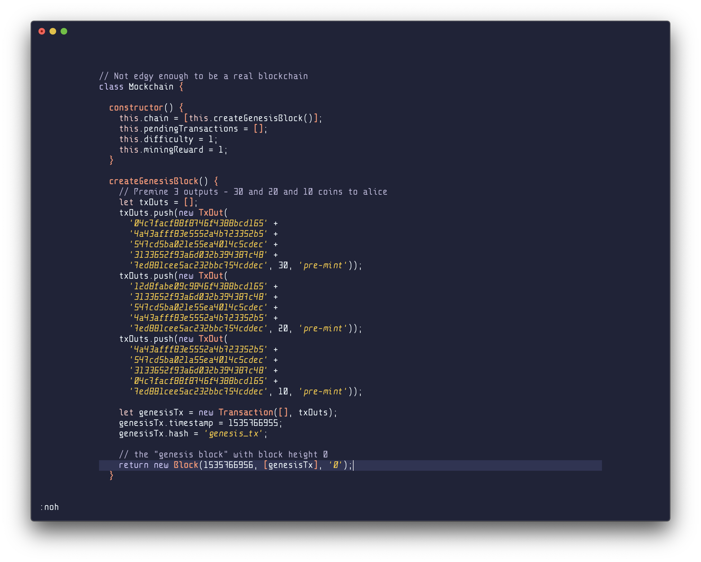
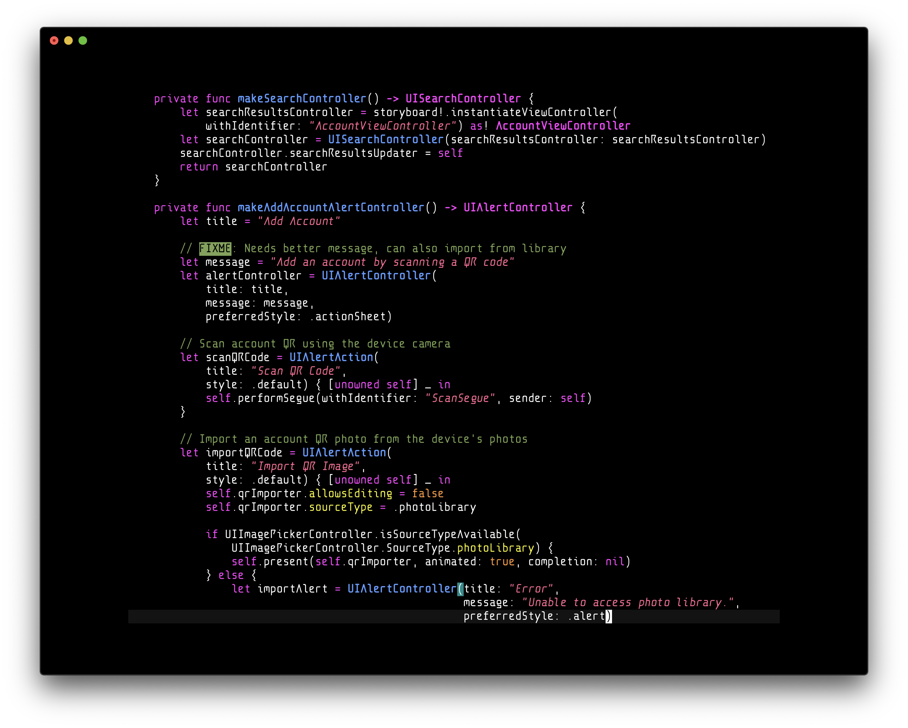

___

**Fontbakery:**

A unique monospaced programming font. Designed as a deviation from traditional monospaced fonts, Anomaly Mono manages to maintain perfect legibility and clear distinction between alphabetical and numeric glyphs, while providing an unconventional aesthetic.

## Additional Features
- [x] Powerline glyphs
- [ ] Ligatures

## Install
Download the AnomalyMonoRegular.otf and open it. Your OS should prompt you with an option to install the new font.

If you're on Linux, you can also create an "AnomalyMono" directory under `/usr/share/fonts`, and move the OTF file into the new directory.

## Screenshots

## Author/License
Created by [Ben Busby](https://benbusby.com) (contact@benbusby.com)

Licensed under the SIL Open Font License ([see LICENSE](LICENSE))
